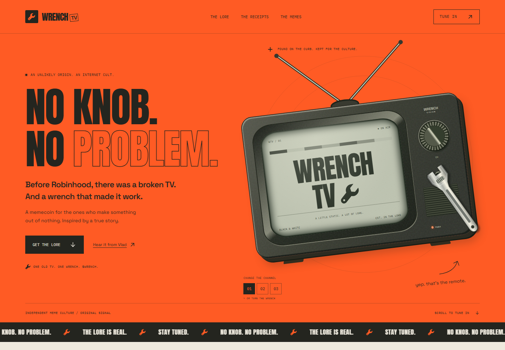

# Wrench TV

[Live website](https://wrenchtv.vercel.app) · [GitHub](https://github.com/Aymaneerrachidi/wrenchtv)

A standalone React + TypeScript + Vite website for the Wrench TV memecoin concept. This project is separate from the adjacent ETRADE project.



## Run locally

```sh
npm install
npm run dev
```

## Add launch details later

Copy `.env.example` to `.env.local`. Update the ticker, contract, buy link, X link, and Telegram link there. Restart the development server after editing. Production changes require a new build. All `VITE_` variables are public.

Empty values display the coming-soon state. Official links appear only when valid HTTPS URLs are configured. No contract, network, token supply, or social account is invented.

## Build

```sh
npm run lint
npm run build
npm run preview
```

With the development server running, `npm run verify` checks the TV controls, meme downloads, eight viewport sizes, mobile navigation, reduced motion, runtime errors, and WCAG A/AA accessibility. Install the test browser once with `npx playwright install chromium`.

The page and fonts are self-hosted. Only the external podcast, transcript, and configured community/buy links need third-party services. No wallet connection or backend is required.

Vercel deploys the generated `dist` directory. This repository is connected to the `wrenchtv` Vercel project; pushes to `main` trigger production deployments. When adding a custom domain, update the canonical and Open Graph URLs in `index.html`.

## Features

- Custom interactive CRT television: turn the wrench, use the dial, select a channel, or switch the TV off.
- Three illustrated lore chapters and direct source links.
- Three downloadable 1080 × 1080 PNG memes, generated locally in the browser.
- Responsive navigation, keyboard focus, reduced-motion support, and self-hosted fonts.
- Configurable token details, copy-address button, and official community links.

## Sources

Vlad Tenev tells the story in [Tetragrammaton with Rick Rubin, Part 2](https://www.iheart.com/podcast/1333-tetragrammaton-with-rick-329505932/episode/vlad-tenev-part-2-335191499/). The TV story starts at approximately 1:08:58, and the wrench is discussed at 1:09:24 in the [transcript](https://podscripts.co/podcasts/tetragrammaton-with-rick-rubin/vlad-tenev-part-2).

The television and graphics are original SVG/CSS illustrations, not photographs of the actual television. Fonts: Anton, Space Grotesk, and IBM Plex Mono, licensed under the SIL Open Font License; licenses are included in `public/fonts`.

This is an independent meme project. No affiliation with or endorsement by Vlad Tenev, Robinhood, Rick Rubin, or Tetragrammaton is implied.

No source-code license has been added. Public visibility does not grant explicit rights to reuse the code.
